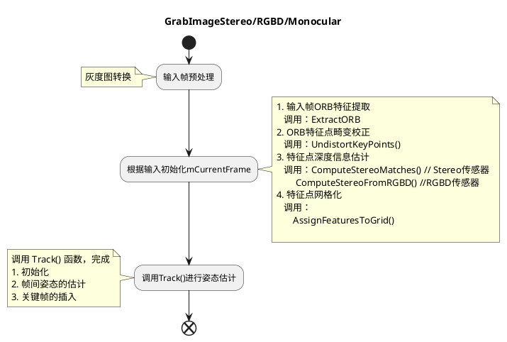
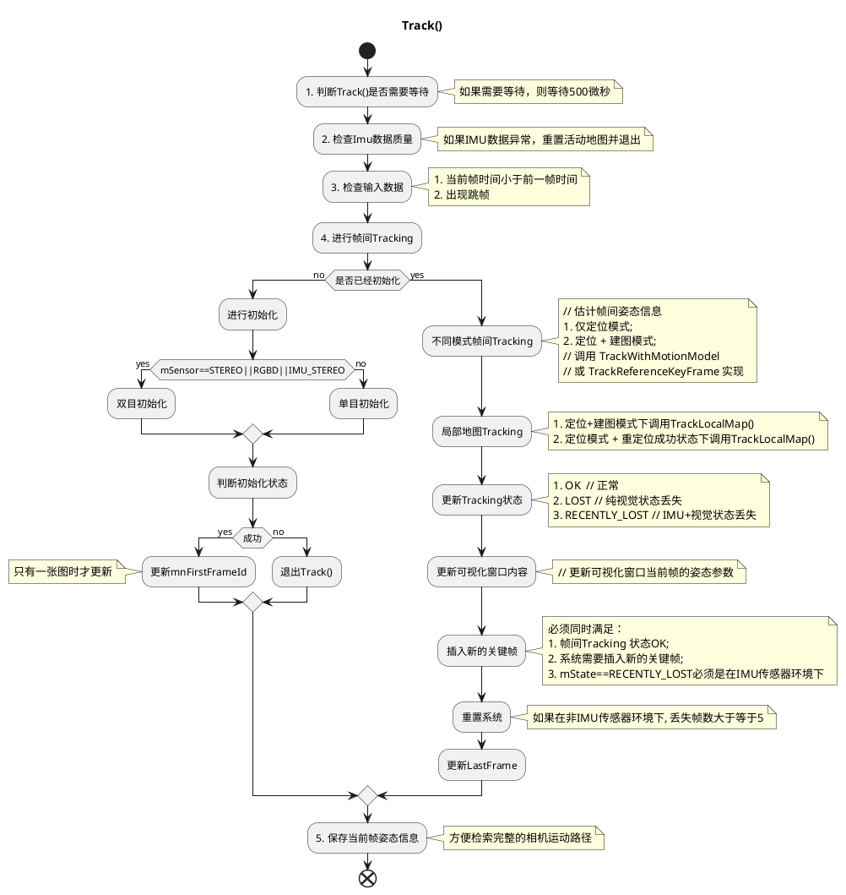

```plantuml
@startuml
title GrabImageStereo/RGBD/Monocular
start
:输入帧预处理;
note left
灰度图转换
end note
:根据输入初始化mCurrentFrame;
note right
1. 输入帧ORB特征提取
   调用：ExtractORB
2. ORB特征点畸变校正
   调用：UndistortKeyPoints()
3. 特征点深度信息估计
   调用：ComputeStereoMatches() // Stereo传感器
        ComputeStereoFromRGBD() //RGBD传感器
4. 特征点网格化
   调用：
       AssignFeaturesToGrid()

end note
:调用Track()进行姿态估计;
note left
调用 Track() 函数，完成
1. 初始化
2. 帧间姿态的估计
3. 关键帧的插入
end note
end
@enduml
```

```plantuml
@startuml
title Track()
start
:1. 判断Track()是否需要等待;
note right
如果需要等待，则等待500微秒
end note
:2. 检查Imu数据质量;
note right
如果IMU数据异常，重置活动地图并退出
end note
:3. 检查输入数据;
note right
1. 当前帧时间小于前一帧时间
2. 出现跳帧
end note
:4. 进行帧间Tracking;
if (是否已经初始化) then (no)
:进行初始化;
if (mSensor==STEREO||RGBD||IMU_STEREO) then (yes)
:双目初始化;
else (no)
:单目初始化;
endif
:判断初始化状态;
if (成功) then (yes)
:更新mnFirstFrameId;
note left
只有一张图时才更新
end note
else (no)
:退出Track();
endif

else (yes) 
:不同模式帧间Tracking;
note right
// 估计帧间姿态信息
1. 仅定位模式;
2. 定位 + 建图模式;
// 调用 TrackWithMotionModel
// 或 TrackReferenceKeyFrame 实现
end note
:局部地图Tracking;
note right
1. 定位+建图模式下调用TrackLocalMap()
2. 定位模式 + 重定位成功状态下调用TrackLocalMap()
end note
:更新Tracking状态;
note right
1. OK  // 正常
2. LOST // 纯视觉状态丢失
3. RECENTLY_LOST // IMU+视觉状态丢失
end note
:更新可视化窗口内容;
note right
// 更新可视化窗口当前帧的姿态参数
end note
:插入新的关键帧;
note right
必须同时满足：
1. 帧间Tracking 状态OK;
2. 系统需要插入新的关键帧;
3. mState==RECENTLY_LOST必须是在IMU传感器环境下
end note
:重置系统;
note right
如果在非IMU传感器环境下, 丢失帧数大于等于5
end note
:更新LastFrame;
endif
:5. 保存当前帧姿态信息;
note right
方便检索完整的相机运动路径
end note
end
@enduml
```